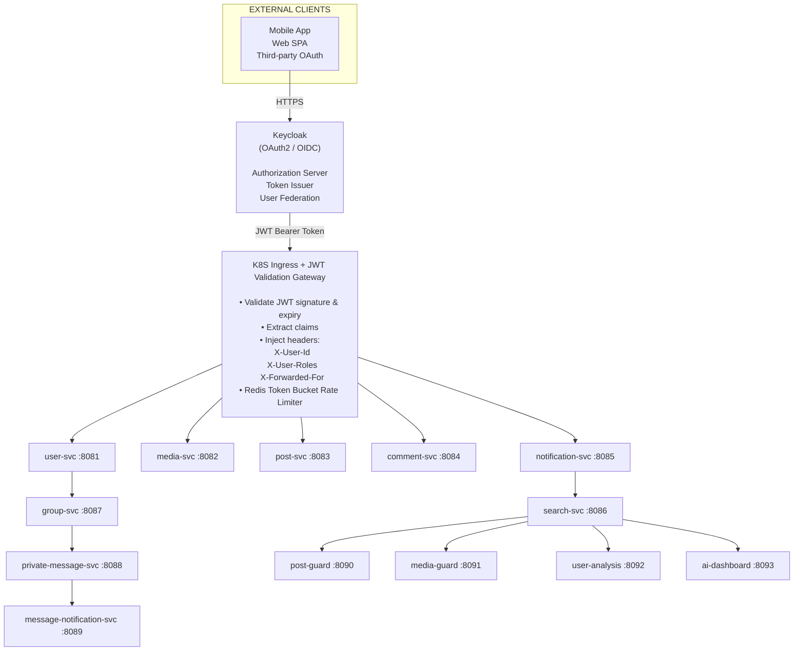
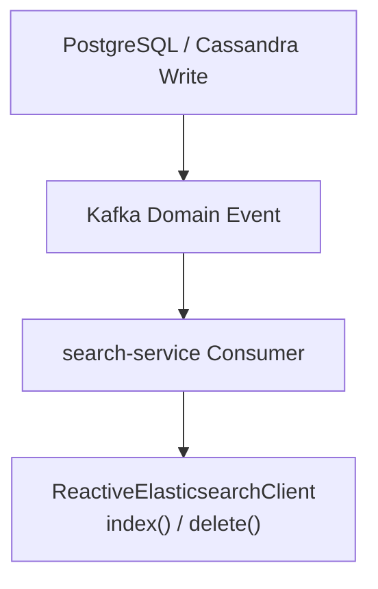
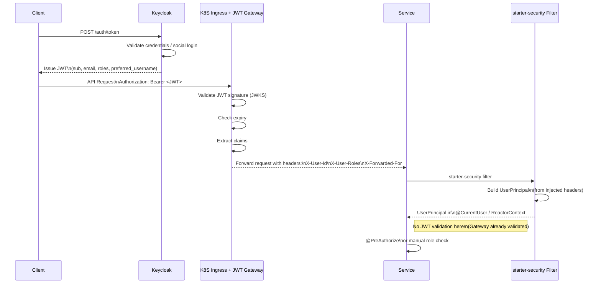
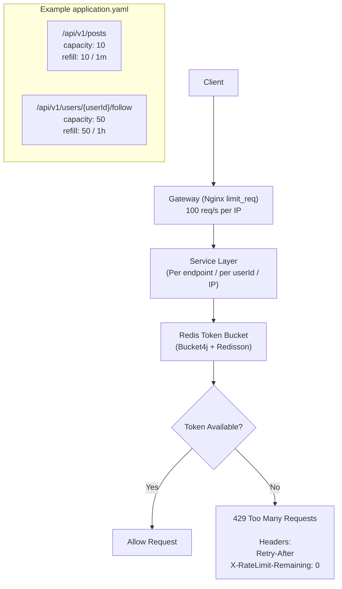
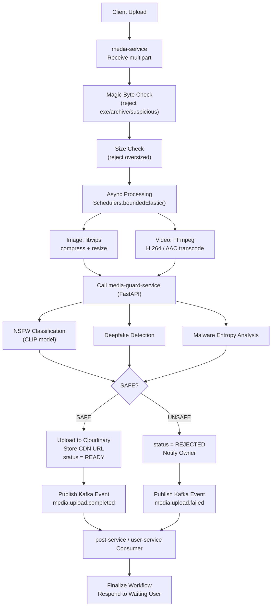
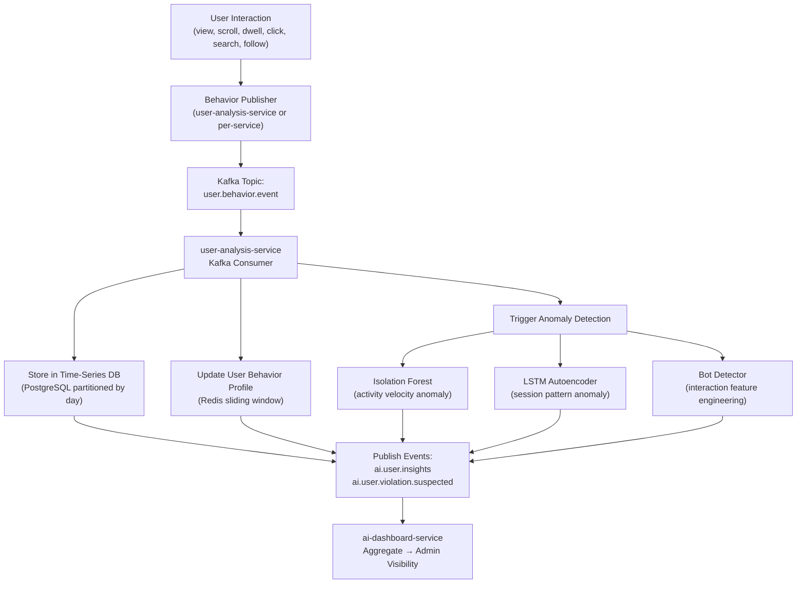
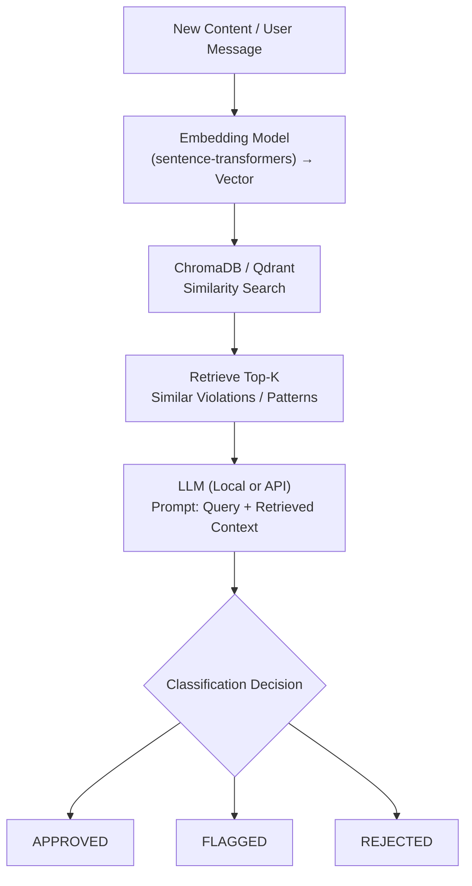

# Architecture — X Social Platform Backend

## 1. High-Level Architecture



---

## 2. Inter-Service Communication

### 2.1 Synchronous — Reactive HTTP (WebClient)

Used **only** for blocking-required calls where the caller awaits a response:

| Caller                       | Callee                  | Purpose                                          |
| ---------------------------- | ----------------------- | ------------------------------------------------ |
| user-service                 | media-service           | Upload avatar/background                         |
| post-service                 | media-service           | Confirm media upload                             |
| post-service                 | post-guard-service      | Pre-publish content check                        |
| media-service                | media-guard-service     | NSFW/malware scan                                |
| group-service                | media-service           | Upload group avatar/background                   |
| group-service                | post-service            | Create post in group context                     |
| private-message-service      | media-service           | Upload message media attachments                 |
| message-notification-service | private-message-service | Fetch participant notification settings (cached) |

All WebClient calls use:

- `timeout(Duration.ofSeconds(5))`
- `retryWhen(Retry.backoff(3, Duration.ofMillis(200)))`
- Circuit breaker via Resilience4j (`@CircuitBreaker`)

### 2.2 Asynchronous — Apache Kafka

Used for domain events, fan-out notifications, analytics ingestion.

| TOPIC                          | PUBLISHER                | CONSUMERS                                         |
| ------------------------------ | ------------------------ | ------------------------------------------------- |
| user.profile.updated           | user-svc                 | search-svc, user-analysis-svc                     |
| user.avatar.changed            | user-svc                 | post-svc (auto-post), search-svc                  |
| user.followed                  | user-svc                 | notification-svc, user-analysis-svc               |
| user.verified                  | user-svc                 | notification-svc                                  |
| media.upload.completed         | media-svc                | post-svc, user-svc                                |
| media.upload.failed            | media-svc                | post-svc, user-svc                                |
| post.created                   | post-svc                 | notification-svc, search-svc, user-analysis-svc   |
| post.liked                     | post-svc                 | notification-svc, user-analysis-svc               |
| post.reposted                  | post-svc                 | notification-svc, search-svc                      |
| post.deleted                   | post-svc                 | search-svc                                        |
| post.reported                  | post-svc                 | ai-dashboard-svc                                  |
| comment.created                | comment-svc              | notification-svc, search-svc, user-analysis-svc   |
| comment.liked                  | comment-svc              | notification-svc                                  |
| notification.read              | notification-svc         | notification-svc (multi-device)                   |
| group.created                  | group-svc                | search-svc, user-analysis-svc                     |
| group.updated                  | group-svc                | search-svc                                        |
| group.deleted                  | group-svc                | search-svc, private-message-svc                   |
| group.member.joined            | group-svc                | notification-svc, user-analysis-svc               |
| group.member.left              | group-svc                | notification-svc, private-message-svc             |
| group.member.role.changed      | group-svc                | notification-svc                                  |
| group.member.banned            | group-svc                | notification-svc                                  |
| group.post.pinned              | group-svc                | notification-svc                                  |
| group.post.created             | group-svc                | search-svc                                        |
| message.sent                   | private-message-svc      | message-notification-svc, user-analysis-svc       |
| message.delivered              | private-message-svc      | private-message-svc (read receipt sync)           |
| message.read                   | private-message-svc      | private-message-svc (multi-device sync)           |
| message.reaction.added         | private-message-svc      | message-notification-svc                          |
| message.reaction.removed       | private-message-svc      | (internal)                                        |
| message.forwarded              | private-message-svc      | (internal)                                        |
| message.deleted                | private-message-svc      | (internal)                                        |
| conversation.created           | private-message-svc      | notification-svc                                  |
| conversation.settings.updated  | private-message-svc      | message-notification-svc (refresh settings cache) |
| message.notification.delivered | message-notification-svc | private-message-svc (update delivery log)         |
| message.notification.failed    | message-notification-svc | ai-dashboard-svc                                  |
| user.behavior.event            | user-analysis-svc        | user-analysis-svc (self)                          |
| ai.user.insights               | user-analysis-svc        | ai-dashboard-svc                                  |
| ai.user.violation.suspected    | user-analysis-svc        | ai-dashboard-svc, user-svc (auto-flag)            |
| ai.model.updated               | post-guard-svc           | ai-dashboard-svc                                  |

**Kafka Guarantees:**

- Producer: `acks=all`, `enable.idempotence=true`.
- Consumer: manual offset commit after successful processing.
- Dead Letter Topic (DLT) per topic for failed consumer records.
- 3 partitions per topic minimum; replication factor 3 in prod.

### 2.3 Event Sourcing — Axon Framework

Used for **behavioral propagation** (user preferences affecting multiple services):

```
user-svc ──[UpdateUserPreferencesCommand]──► Axon Server
             │
             └──► [UserPreferencesUpdatedEvent] broadcast to:
                     notification-svc  (update delivery rules)
                     post-svc          (update feed personalization)
                     user-analysis-svc (register preference change)
```

Axon events are **not** used for data fetch — use Kafka consumers or WebClient for that.

---

## 3. Data Architecture

### 3.1 Database Selection Rationale

| Service                      | DB                     | Reason                                                       |
| ---------------------------- | ---------------------- | ------------------------------------------------------------ |
| user-service                 | PostgreSQL             | ACID, complex relational queries, Keycloak sync              |
| media-service                | PostgreSQL             | Metadata, foreign keys to owners                             |
| post-service                 | PostgreSQL             | ACID for post/like/bookmark consistency                      |
| comment-service              | **Cassandra**          | High write throughput, append-only, cursor pagination        |
| notification-service         | **Cassandra**          | High fan-out writes, time-sorted, multi-device               |
| search-service               | **Elasticsearch**      | Full-text search, aggregations, autocomplete                 |
| group-service                | PostgreSQL             | Relational: membership hierarchy, policy, ACID join flows    |
| private-message-service      | **Cassandra**          | Append-heavy message writes, time-sorted, high fan-out reads |
| message-notification-service | **Cassandra**          | Device token registry, delivery log TTL cleanup              |
| AI services                  | PostgreSQL + vector DB | Structured ML data + similarity search                       |

### 3.2 Caching Strategy

```mermaid
flowchart TD

    %% ================= READ PATH =================
    subgraph READ_PATH["READ PATH"]
        Req["Client Request"]
        L1["L1 Local Cache<br/>(Caffeine, 1s TTL, hot set)"]
        L2["L2 Redis Cache<br/>(@Cacheable, configurable TTL)"]
        DB["Database"]

        Req --> L1
        L1 -->|miss| L2
        L2 -->|miss| DB
    end

    %% ================= WRITE PATH =================
    subgraph WRITE_PATH["WRITE PATH (Write-Through)"]
        Mutation["Mutation Request"]
        DB2["Database"]
        RedisUpdate["Evict / Update Redis<br/>(@CacheEvict / @CachePut)"]
        Kafka["Publish Domain Event<br/>(Kafka)"]

        Mutation --> DB2
        DB2 --> RedisUpdate
        RedisUpdate --> Kafka
    end

    %% ================= DISTRIBUTED LOCK =================
    subgraph DISTRIBUTED_LOCK["DISTRIBUTED LOCK (Redisson)"]
        CriticalOp["Critical Write Operation<br/>(follow/unfollow counters,<br/>post counters)"]
        Lock["RLock<br/>lock:user:{userId}:follow"]
        TryLock["tryLock(500ms wait,<br/>5s lease)"]
        Update["Perform Update"]
        Unlock["unlock()"]

        CriticalOp --> Lock
        Lock --> TryLock
        TryLock -->|success| Update
        Update --> Unlock
    end
```



**TTL Guidelines:**

| Data              | TTL        |
| ----------------- | ---------- |
| User profile      | 5 minutes  |
| Post detail       | 5 minutes  |
| Home feed         | 30 seconds |
| Trending hashtags | 1 minute   |
| Search results    | 30 seconds |
| Media URLs        | 24 hours   |
| Follower counts   | 1 minute   |

### 3.3 Elasticsearch Sync

Change Data Capture (CDC) via Kafka events:



No Debezium CDC connector required — services publish their own events.

---

## 4. Authentication & Authorization Flow



---

## 5. Rate Limiting Architecture



---

## 6. Media Processing Pipeline



---

## 7. AI Architecture

### 7.1 Behavior Tracking Pipeline



### 7.2 RAG Pipeline



### 7.3 Model Lifecycle

```mermaid
flowchart TD

    subgraph Daily_Training_Job["1. Daily Scheduled Job (APScheduler)"]
        A["Query New Labeled Data<br/>(Human-reviewed violations)"]
        B["Fine-tune BERT / Update Classifier Weights"]
        C["Update ChromaDB Vector Index"]
        D["Version Model<br/>(Timestamped)"]
        E["Publish ai.model.updated<br/>to Kafka"]
        F["ai-dashboard-service<br/>Registers New Version"]

        A --> B --> C --> D --> E --> F
    end

    subgraph AB_Shadow_Mode["2. A/B Shadow Mode"]
        ShadowRun["New Model Runs in Parallel<br/>(No user impact)"]
        LogDecision["Log Decisions"]
        Compare["Compare Accuracy vs Baseline<br/>(24h Evaluation)"]
        Promote["Promote if Metrics Pass"]

        ShadowRun --> LogDecision --> Compare --> Promote
    end
```



---

## 8. High Availability Design

### 8.1 Service Redundancy

```yaml
# HPA per service
minReplicas: 2
maxReplicas: 10
metrics:
  - cpu > 70%
  - http_requests_per_second > 1000

# PodDisruptionBudget
minAvailable: 1

# Anti-affinity (spread across nodes)
podAntiAffinity:
  preferredDuringSchedulingIgnoredDuringExecution:
    - topologyKey: kubernetes.io/hostname
```

### 8.2 Database HA

| Component     | HA Setup                                                     |
| ------------- | ------------------------------------------------------------ |
| PostgreSQL    | Primary + 1 replica (streaming replication) + PgBouncer pool |
| Cassandra     | 3-node cluster, RF=3, consistency level QUORUM               |
| Elasticsearch | 3 master + 3 data nodes, 1 replica per index                 |
| Redis         | Redis Sentinel (1 primary, 2 replicas) or Redis Cluster      |
| Kafka         | 3 brokers, RF=3, ISR=2                                       |

### 8.3 Failure Handling

- **Circuit Breaker** (Resilience4j): all WebClient calls to external services.
- **Retry with exponential backoff**: Kafka producer, WebClient (max 3 attempts).
- **Timeout** on all external I/O: WebClient (5s), Redis (1s), DB query (10s).
- **Bulkhead** (thread pool isolation): media processing isolated from main reactive thread pool.
- **Graceful degradation**: search results fall back to cached results if ES is down.

---

## 9. Security Architecture

| Layer            | Control                                                                 |
| ---------------- | ----------------------------------------------------------------------- |
| Network          | K8S NetworkPolicy — services cannot reach each other's DB directly      |
| Auth             | Keycloak JWT, RS256, short-lived tokens (15min access, 7d refresh)      |
| Authorization    | Role-based (`@PreAuthorize`) + ownership check in service layer         |
| Rate limiting    | Token bucket per user/IP (Redis)                                        |
| Input validation | Bean Validation `@Valid` on all DTOs; reactive validator in common-core |
| SQL injection    | R2DBC parameterized queries only                                        |
| SSRF             | Allowlist for external URL calls in media-service                       |
| Secrets          | Kubernetes Secrets + Sealed Secrets or Vault                            |
| TLS              | mTLS between services inside cluster (Istio service mesh optional)      |

---

# 10. Deployment Topology (Kubernetes)

## Namespace Overview

- **Infrastructure Namespace**
- **Application Namespace:** `x-social`

---

## 1️⃣ Infrastructure Layer

| Component | Type | Replicas / Notes |
|------------|------|-----------------|
| kafka-0,1,2 | StatefulSet | 3 brokers |
| cassandra-0,1,2 | StatefulSet | 3 nodes |
| elasticsearch-0,1,2 | StatefulSet | 3 nodes |
| redis-0 | StatefulSet | Primary |
| redis-1,2 | StatefulSet | Replicas |
| postgresql-primary | StatefulSet | Primary |
| postgresql-replica | StatefulSet | Read replica |
| keycloak-0,1 | Deployment (HA) | 2 replicas |
| axon-server-0 | StatefulSet | Single node |
| zipkin | Deployment | Distributed tracing |

---

## 2️⃣ Application Layer (`x-social` namespace)

| Service | Workload Type | HPA Range | Notes |
|----------|--------------|------------|-------|
| user-service | Deployment | 2–10 |  |
| media-service | Deployment | 2–10 |  |
| post-service | Deployment | 2–10 |  |
| comment-service | Deployment | 2–10 |  |
| notification-service | Deployment | 2–10 |  |
| search-service | Deployment | 2–8 |  |
| group-service | Deployment | 2–8 |  |
| private-message-service | Deployment | 2–10 |  |
| message-notification-service | Deployment | 2–8 |  |
| post-guard-service | Deployment | 2–6 | GPU optional |
| media-guard-service | Deployment | 2–6 | GPU optional |
| user-analysis-service | Deployment | 2–4 |  |
| ai-dashboard-service | Deployment | 2–4 |  |

---

## Scaling Strategy

- All application services use **Horizontal Pod Autoscaler (HPA)**.
- Core user-facing services scale higher (up to 10 replicas).
- AI/analysis services scale conservatively (up to 4–6 replicas).
- Infrastructure components use **StatefulSets** for persistence and cluster coordination.

---

## 11. Monitoring & Alerting

```
Metrics collection:  Prometheus scrapes /actuator/prometheus every 15s
Dashboards:          Grafana (per-service RED metrics: Rate, Errors, Duration)
Distributed tracing: Zipkin (sampled at 10% prod, 100% dev)
Log aggregation:     Fluentd → Elasticsearch → Kibana
Alerting:            AlertManager → PagerDuty / Slack

Key SLO targets:
  p99 latency    < 500ms (read endpoints)
  p99 latency    < 2s    (write + media upload)
  Availability   ≥ 99.9% (monthly)
  Error rate     < 0.1%
```
