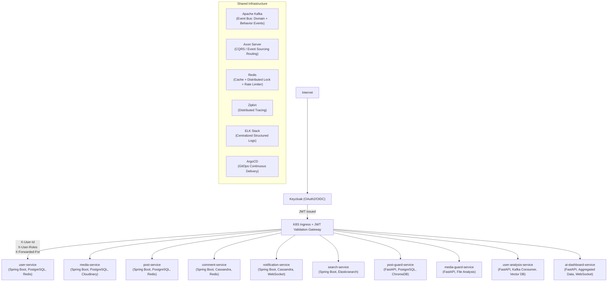

# Supar Simple Social Platform — Backend

> Production-ready reactive microservice backend modeled after X (Twitter).  
> Spring Boot 4.0.2 · FastAPI 0.133 · Kafka · Axon · Keycloak · Kubernetes

---

## Table of Contents

- [Overview](#overview)
- [Architecture at a Glance](#architecture-at-a-glance)
- [Services](#services)
- [Shared Modules](#shared-modules)
- [Technology Stack](#technology-stack)
- [Getting Started](#getting-started)
- [CI/CD](#cicd)
- [Documentation Index](#documentation-index)

---

## Overview

`x-social-platform` is a backend-only distributed system that powers a feature-complete social media platform. All services are designed to be **cloud-native**, **highly available**, **low-latency**, and **production-ready** from day one.

Key architectural principles:

- **Reactive everywhere** — Spring WebFlux/R2DBC for Spring Boot; async/await throughout FastAPI.
- **Event-driven** — Kafka for domain events, Axon Framework for CQRS/ES behavioral propagation.
- **Stateless services** — JWT claims forwarded by K8S gateway; no per-service auth logic.
- **Soft-delete by default** — user data is never physically deleted.
- **Observability first** — structured logging, distributed tracing (Zipkin), Prometheus metrics on every service.
- **AI-augmented** — FastAPI AI services for content moderation, behavior analysis, and recommendation.

---

## Architecture at a Glance



See [ARCHITECTURE.md](./ARCHITECTURE.md) for the complete architecture document.

---

## Services

### Spring Boot Services

| Service | Port | Database | Description |
|---------|------|----------|-------------|
| [user-service](./services/user-service.md) | 8081 | PostgreSQL | User profiles, followers, settings, Keycloak sync |
| [media-service](./services/media-service.md) | 8082 | PostgreSQL + Cloudinary | Media upload/processing/CDN |
| [post-service](./services/post-service.md) | 8083 | PostgreSQL | Posts, likes, reposts, bookmarks, feeds |
| [comment-service](./services/comment-service.md) | 8084 | Cassandra | Nested comments, high write throughput |
| [notification-service](./services/notification-service.md) | 8085 | Cassandra | Real-time push, multi-device sync |
| [search-service](./services/search-service.md) | 8086 | Elasticsearch | Full-text search, trending, autocomplete |
| [group-service](./services/group-service.md) | 8087 | PostgreSQL | Groups, membership, roles, pinned posts, join screening |
| [private-message-service](./services/private-message-service.md) | 8088 | Cassandra | DM & group chat, reactions, forwarding, real-time WebSocket |
| [message-notification-service](./services/message-notification-service.md) | 8089 | Cassandra | Push notifications for messages (FCM, APNs, Web Push) |

### FastAPI (Python) AI Services

| Service | Port | Description |
|---------|------|-------------|
| [post-guard-service](./services/post-guard-service.md) | 8090 | Content moderation (spam, phishing, TOS) |
| [media-guard-service](./services/media-guard-service.md) | 8091 | Media safety: NSFW, malware, deepfake detection |
| [user-analysis-service](./services/user-analysis-service.md) | 8092 | User behavior analysis, bot detection, recommendations |
| [ai-dashboard-service](./services/ai-dashboard-service.md) | 8093 | Admin AI dashboard, moderation queue |

---

## Shared Modules

Located under `spring-services/`:

| Module | Description |
|--------|-------------|
| [common-core](./modules/common-core.md) | Shared exceptions, error handlers, enums, base entities, API response wrappers |
| [starter-kafka](./modules/starters.md#starter-kafka) | Reactive Kafka producer/consumer, DLT, retry |
| [starter-redis](./modules/starters.md#starter-redis) | Redis + Redisson, `@Cacheable`, rate limiter |
| [starter-elasticsearch](./modules/starters.md#starter-elasticsearch) | Reactive ES client configuration |
| [starter-metrics](./modules/starters.md#starter-metrics) | Micrometer, Zipkin, Prometheus, health actuator |
| [starter-postgres](./modules/starters.md#starter-postgres) | R2DBC, Flyway migration |
| [starter-cassandra](./modules/starters.md#starter-cassandra) | Reactive Cassandra configuration |
| [starter-websocket](./modules/starters.md#starter-websocket) | Reactive WebSocket config |
| [starter-security](./modules/starters.md#starter-security) | JWT claim extraction, `@CurrentUser` annotation |

---

## Technology Stack

### Core

| Layer | Technology |
|-------|-----------|
| Spring Boot services | Spring Boot 4.0.2, Java 21, Maven |
| FastAPI services | FastAPI 0.133, Python 3.12 |
| Reactive runtime | Spring WebFlux, Project Reactor, asyncio |
| API gateway / Auth | Keycloak (OAuth2 + OIDC), K8S Ingress JWT validation |
| Event bus | Apache Kafka (reactor-kafka) |
| CQRS / ES | Axon Framework |

### Data

| Purpose | Technology |
|---------|-----------|
| Relational (OLTP) | PostgreSQL 16 (R2DBC) |
| High-throughput writes | Apache Cassandra 4 (reactive) |
| Full-text search | Elasticsearch 8 (reactive) |
| Cache + distributed lock | Redis 7 + Redisson |
| Media CDN | Cloudinary |
| Vector store (RAG) | ChromaDB / Qdrant |

### Observability

| Purpose | Technology |
|---------|-----------|
| Distributed tracing | Zipkin + OpenTelemetry |
| Metrics | Micrometer + Prometheus |
| Logging | Logback (JSON) + ELK Stack |
| API documentation | SpringDoc OpenAPI 3 / FastAPI OpenAPI |

### Infrastructure

| Purpose | Technology |
|---------|-----------|
| Containerization | Docker (extracted JAR + Python multistage) |
| Orchestration | Kubernetes + Helm |
| CI | Jenkins (declarative pipelines) |
| CD | ArgoCD (GitOps) |
| Rate limiting | Bucket4j + Redisson token bucket |

---

## Getting Started

### Prerequisites

- Docker Desktop ≥ 4.x
- Java 21 (SDKMAN recommended)
- Python 3.12 + pip
- Maven ≥ 3.9
- Helm ≥ 3.14
- kubectl

### Local Development (Docker Compose)

```bash
# Start all infrastructure (Kafka, PostgreSQL, Cassandra, Redis, Elasticsearch, Keycloak, Zipkin)
docker compose -f docker-compose.infra.yml up -d

# Build all Spring services
cd spring-services && mvn clean package -DskipTests

# Run a single service
docker compose -f docker-compose.services.yml up user-service

# Run all services
docker compose -f docker-compose.services.yml up
```

### Running Tests

```bash
# Unit tests only
mvn test

# Integration tests (requires Docker for Testcontainers)
mvn failsafe:integration-test

# Automation tests
mvn failsafe:integration-test -P automation

# Python services
cd python-services/post-guard-service
pytest tests/ -v --cov=app --cov-report=term-missing
```

### Accessing Services

| Service | URL |
|---------|-----|
| Keycloak Admin | http://localhost:8080/admin |
| user-service API | http://localhost:8081/swagger-ui.html |
| post-service API | http://localhost:8083/swagger-ui.html |
| Zipkin | http://localhost:9411 |
| Kibana (logs) | http://localhost:5601 |
| Grafana (metrics) | http://localhost:3000 |

---

## CI/CD

### Continuous Integration — Jenkins

Each service has its own `Jenkinsfile` under `infrastructure/jenkins/`.

Pipeline stages:
1. **Checkout** — clone GitOps source
2. **Build & Unit Test** — Maven / pytest with JaCoCo / pytest-cov (≥ 80% required)
3. **Integration Test** — Testcontainers-based tests
4. **SonarQube Analysis** — code quality gate
5. **Docker Build & Push** — multi-arch image to registry
6. **Helm Lint & Template** — validate chart
7. **Update GitOps Repo** — bump image tag → triggers ArgoCD sync

### Continuous Delivery — ArgoCD

ArgoCD watches the `infrastructure/helm/charts/` directory. On new image tag commit:

- Automated sync with pruning and self-healing.
- Progressive delivery via `Rollout` (Argo Rollouts canary strategy).
- Each service has its own `Application` resource in `infrastructure/argocd/`.

---

## Documentation Index

| Document | Description |
|----------|-------------|
| [ARCHITECTURE.md](./ARCHITECTURE.md) | Full system architecture, data flows, HA design |
| [CONVENTIONS.md](./CONVENTIONS.md) | Coding conventions, naming rules, Git workflow |
| [services/user-service.md](./services/user-service.md) | user-service deep-dive |
| [services/media-service.md](./services/media-service.md) | media-service deep-dive |
| [services/post-service.md](./services/post-service.md) | post-service deep-dive |
| [services/comment-service.md](./services/comment-service.md) | comment-service deep-dive |
| [services/notification-service.md](./services/notification-service.md) | notification-service deep-dive |
| [services/search-service.md](./services/search-service.md) | search-service deep-dive |
| [services/group-service.md](./services/group-service.md) | group-service deep-dive |
| [services/private-message-service.md](./services/private-message-service.md) | private-message-service deep-dive |
| [services/message-notification-service.md](./services/message-notification-service.md) | message-notification-service deep-dive |
| [services/post-guard-service.md](./services/post-guard-service.md) | post-guard FastAPI AI service |
| [services/media-guard-service.md](./services/media-guard-service.md) | media-guard FastAPI AI service |
| [services/user-analysis-service.md](./services/user-analysis-service.md) | user analysis FastAPI AI service |
| [services/ai-dashboard-service.md](./services/ai-dashboard-service.md) | AI admin dashboard FastAPI service |
| [modules/common-core.md](./modules/common-core.md) | common-core module reference |
| [modules/starters.md](./modules/starters.md) | All starters reference |

---

*Last updated: 2026 · Maintained by Lvoxx's Engineering Team*