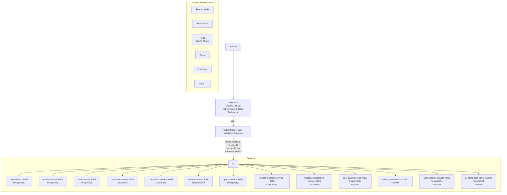

# X Social Platform — Backend

> Production-ready reactive microservice backend modelled after X (Twitter).  
> Spring Boot 4.0.2 · FastAPI 0.133 · Kafka · Axon · Keycloak · Kubernetes

---

## Table of Contents

- [Architecture](#architecture)
- [Services](#services)
- [Shared Modules](#shared-modules)
- [Technology Stack](#technology-stack)
- [Getting Started](#getting-started)
- [Database Initialisation](#database-initialisation)
- [CI/CD](#cicd)
- [Documentation Index](#documentation-index)

---

## Architecture


```mermaid
flowchart TD

    A[Internet] --> B[Keycloak<br/>OAuth2 / OIDC<br/>Token Issuer & User Federation]

    B -->|JWT| C[K8S Ingress + JWT Validation Gateway]

    C -->|Inject Headers<br/>X-User-Id<br/>X-User-Roles<br/>X-Forwarded-For| D

    subgraph Services
        D --> S1[user-service :8081<br/>PostgreSQL]
        D --> S2[media-service :8082<br/>PostgreSQL]
        D --> S3[post-service :8083<br/>PostgreSQL]
        D --> S4[comment-service :8084<br/>Cassandra]
        D --> S5[notification-service :8085<br/>Cassandra]
        D --> S6[search-service :8086<br/>Elasticsearch]
        D --> S7[group-service :8087<br/>PostgreSQL]
        D --> S8[private-message-service :8088<br/>Cassandra]
        D --> S9[message-notification-service :8089<br/>Cassandra]
        D --> S10[post-guard-service :8090<br/>PostgreSQL<br/>FastAPI]
        D --> S11[media-guard-service :8091<br/>FastAPI]
        D --> S12[user-analysis-service :8092<br/>PostgreSQL<br/>FastAPI]
        D --> S13[ai-dashboard-service :8093<br/>PostgreSQL<br/>FastAPI]
    end

    subgraph Shared Infrastructure
        I1[Apache Kafka]
        I2[Axon Server]
        I3[Redis<br/>Cache / Lock]
        I4[Zipkin]
        I5[ELK Stack]
        I6[ArgoCD]
    end
```

### Design principles

- **Reactive everywhere** — Spring WebFlux / R2DBC; fully `async/await` FastAPI.
- **One primary database per service** — PostgreSQL _or_ Cassandra _or_ Elasticsearch. Redis is a cache/lock layer only. Services that would naturally mix two engines are split into separate microservices.
- **No foreign-key constraints** — referential integrity is enforced at the application layer.
- **No table relations across services** — cross-service data fetched via Kafka events or WebClient; never via shared DB.
- **DB init via Kubernetes** — all schema migrations and index mappings are applied by K8S Jobs / InitContainers. Services never run migrations.
- **Soft-delete only** — user-generated data is never physically deleted.
- **JWT validated at the gateway** — services read claims from forwarded headers; zero auth logic in individual services.

---

## Services

### Spring Boot Services

| Service                                                                     | Port | Primary DB    | Description                                          |
| --------------------------------------------------------------------------- | ---- | ------------- | ---------------------------------------------------- |
| [user-service](./documents/user-service.md)                                 | 8081 | PostgreSQL    | Profiles, followers, account settings, Keycloak sync |
| [media-service](./documents/media-service.md)                               | 8082 | PostgreSQL    | Upload, processing pipeline, Cloudinary CDN          |
| [post-service](./documents/post-service.md)                                 | 8083 | PostgreSQL    | Posts, likes, reposts, bookmarks, feeds              |
| [comment-service](./documents/comment-service.md)                           | 8084 | Cassandra     | Nested comments, high-throughput writes              |
| [notification-service](./documents/notification-service.md)                 | 8085 | Cassandra     | Real-time push, multi-device read sync               |
| [search-service](./documents/search-service.md)                             | 8086 | Elasticsearch | Full-text search, trending, autocomplete             |
| [group-service](./documents/group-service.md)                               | 8087 | PostgreSQL    | Groups, membership, roles, join screening            |
| [private-message-service](./documents/private-message-service.md)           | 8088 | Cassandra     | DM & group chat, reactions, forwarding               |
| [message-notification-service](./documents/message-notification-service.md) | 8089 | Cassandra     | Push notifications — FCM, APNs, Web Push             |

### FastAPI AI Services

| Service                                                       | Port | Primary DB | Description                                        |
| ------------------------------------------------------------- | ---- | ---------- | -------------------------------------------------- |
| [post-guard-service](./documents/post-guard-service.md)       | 8090 | PostgreSQL | Content moderation — BERT + RAG                    |
| [media-guard-service](./documents/media-guard-service.md)     | 8091 | —          | NSFW, malware, deepfake detection                  |
| [user-analysis-service](./documents/user-analysis-service.md) | 8092 | PostgreSQL | Behaviour analysis, bot detection, recommendations |
| [ai-dashboard-service](./documents/ai-dashboard-service.md)   | 8093 | PostgreSQL | Admin AI dashboard, moderation queue               |

---

## Shared Modules

Located under `spring-documents/`:

| Module                                                                 | Path                             | Description                                            |
| ---------------------------------------------------------------------- | -------------------------------- | ------------------------------------------------------ |
| [common-core](./documents/common-core.md)                              | `common/common-core`             | Exceptions, ApiResponse, enums, ULID, security context |
| [postgres-starter](./documents/starters.md#postgres-starter)           | `starters/postgres-starter`      | R2DBC connection pool, `ReactiveAuditorAware`          |
| [cassandra-starter](./documents/starters.md#cassandra-starter)         | `starters/cassandra-starter`     | Reactive Cassandra session                             |
| [redis-starter](./documents/starters.md#redis-starter)                 | `starters/redis-starter`         | ReactiveRedisTemplate, Redisson, rate limiter          |
| [kafka-starter](./documents/starters.md#kafka-starter)                 | `starters/kafka-starter`         | Reactive Kafka producer/consumer, DLT                  |
| [elasticsearch-starter](./documents/starters.md#elasticsearch-starter) | `starters/elasticsearch-starter` | Reactive ES client                                     |
| [metrics-starter](./documents/starters.md#metrics-starter)             | `starters/metrics-starter`       | Micrometer, Zipkin, MDC filter                         |
| [websocket-starter](./documents/starters.md#websocket-starter)         | `starters/websocket-starter`     | Reactive WebSocket adapter                             |
| [security-starter](./documents/starters.md#security-starter)           | `starters/security-starter`      | JWT claim extraction, `@CurrentUser`                   |

---

## Technology Stack

| Layer                | Technology                                                |
| -------------------- | --------------------------------------------------------- |
| Spring Boot services | Spring Boot 4.0.2, Java 21, Maven multi-module            |
| FastAPI services     | FastAPI 0.133, Python 3.12                                |
| Reactive runtime     | Spring WebFlux, Project Reactor, asyncio                  |
| Auth                 | Keycloak (OAuth2 + OIDC) — validation at K8S Ingress only |
| Event bus            | Apache Kafka (reactor-kafka / aiokafka)                   |
| CQRS / ES            | Axon Framework                                            |
| Relational DB        | PostgreSQL 16 (R2DBC)                                     |
| Wide-column DB       | Apache Cassandra 4 (reactive)                             |
| Search               | Elasticsearch 8 (reactive)                                |
| Cache / lock         | Redis 7 + Redisson                                        |
| Media CDN            | Cloudinary                                                |
| Vector store         | ChromaDB / Qdrant (AI services only)                      |
| Tracing              | Zipkin + OpenTelemetry                                    |
| Metrics              | Micrometer + Prometheus                                   |
| Logging              | Logback JSON + ELK Stack                                  |
| Containers           | Docker (extracted JAR + Python multi-stage)               |
| Orchestration        | Kubernetes + Helm                                         |
| CI                   | Jenkins (declarative pipelines)                           |
| CD                   | ArgoCD (GitOps)                                           |

---

## Getting Started

### Prerequisites

Docker ≥ 4 · Java 21 · Python 3.12 · Maven ≥ 3.9 · Helm ≥ 3.14 · kubectl

### Start infrastructure locally

```bash
# All infrastructure: Kafka, PostgreSQL, Cassandra, Elasticsearch, Redis, Keycloak, Zipkin
docker compose -f docker-compose.infra.yml up -d

# Apply all schemas (runs the same init containers locally)
./scripts/init-db-local.sh
```

### Build & run services

```bash
cd spring-services && mvn clean package -DskipTests
docker compose -f docker-compose.services.yml up
```

### Run tests

```bash
mvn test                                        # unit tests
mvn failsafe:integration-test                   # integration tests (needs Docker)
cd python-documents/post-guard-service && pytest tests/ -v --cov=app
```

---

## Database Initialisation

**Services never initialise their own schemas.**  
All DDL / CQL / index mappings are applied by Kubernetes resources before the service Pod starts.

| Engine        | K8S resource    | Tool                            | Scripts location                                 |
| ------------- | --------------- | ------------------------------- | ------------------------------------------------ |
| PostgreSQL    | `Job`           | Flyway CLI (`flyway/flyway:10`) | `infrastructure/k8s/db-init/<service>/sql/`      |
| Cassandra     | `InitContainer` | `cqlsh` (`cassandra:4.1`)       | `infrastructure/k8s/db-init/<service>/cql/`      |
| Elasticsearch | `Job`           | `curl` (`curlimages/curl:8`)    | `infrastructure/k8s/db-init/<service>/mappings/` |

The Spring Boot `application.yaml` for Cassandra services always sets `spring.cassandra.schema-action: NONE`.  
PostgreSQL services do not include any `flyway.*` or `spring.flyway.*` configuration.

---

## CI/CD

### Jenkins (CI) — `infrastructure/jenkins/`

Stages: `Checkout` → `Build & Unit Test` → `Integration Test` → `SonarQube` → `Docker Build & Push` → `Helm Lint` → `Update GitOps Repo`

### ArgoCD (CD) — `infrastructure/argocd/`

Watches `infrastructure/helm/charts/`. Automated sync with pruning and self-healing on image tag commit.

---

## Documentation Index

| Document                                                                                 | Description                        |
| ---------------------------------------------------------------------------------------- | ---------------------------------- |
| [ARCHITECTURE.md](./ARCHITECTURE.md)                                                     | Full system design, data flows, HA |
| [CONVENTIONS.md](./CONVENTIONS.md)                                                       | Coding rules, naming, Git workflow |
| [documents/user-service.md](./documents/user-service.md)                                 | user-service                       |
| [documents/media-service.md](./documents/media-service.md)                               | media-service                      |
| [documents/post-service.md](./documents/post-service.md)                                 | post-service                       |
| [documents/comment-service.md](./documents/comment-service.md)                           | comment-service                    |
| [documents/notification-service.md](./documents/notification-service.md)                 | notification-service               |
| [documents/search-service.md](./documents/search-service.md)                             | search-service                     |
| [documents/group-service.md](./documents/group-service.md)                               | group-service                      |
| [documents/private-message-service.md](./documents/private-message-service.md)           | private-message-service            |
| [documents/message-notification-service.md](./documents/message-notification-service.md) | message-notification-service       |
| [documents/post-guard-service.md](./documents/post-guard-service.md)                     | post-guard-service (FastAPI)       |
| [documents/media-guard-service.md](./documents/media-guard-service.md)                   | media-guard-service (FastAPI)      |
| [documents/user-analysis-service.md](./documents/user-analysis-service.md)               | user-analysis-service (FastAPI)    |
| [documents/ai-dashboard-service.md](./documents/ai-dashboard-service.md)                 | ai-dashboard-service (FastAPI)     |
| [documents/common-core.md](./documents/common-core.md)                                   | common-core shared library         |
| [documents/starters.md](./documents/starters.md)                                         | All starters reference             |
